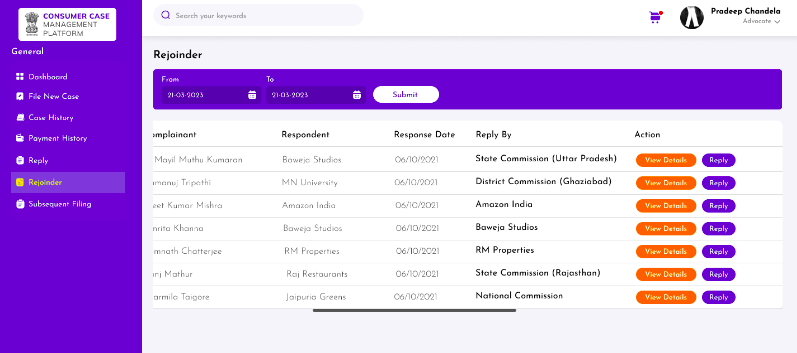

# Help Manual for Consumer Complaint Process

## Table of Contents
1. [Introduction](#introduction)
   1. [Overview](#overview)
2. [e-Jagriti](#e-jagriti)
3. [Key Features](#key-features)
4. [Getting Started](#getting-started)
   1. [Registration](#registration)
   2. [Procedure of Complaint Filing](#procedure-of-complaint-filing)
5. [Commissions (Scrutiny Process)](#commissions)
6. [Reply/Rejoinder/Hearing](#reply-rejoinder-hearing)
7. [Judges Section](#judges-section)
   

## Introduction 

India's Consumer Protection Act of 2019 was introduced in Parliament on July 8, 2019, and enacted on July 20, 2020. This legislation replaces the outdated Consumer Protection Act of 1986, aiming to strengthen consumer rights and provide a framework for faster, more efficient resolution of consumer disputes.

Key features of the Act include:

1. **Establishment of the Central Consumer Protection Authority (CCPA)**
2. **Comprehensive Rules and Regulations**
3. **Expanded Definition of 'Consumer'**
4. **Consumer Disputes Redressal Commissions (CDRCs)**
5. **Mediation**

The Consumer Protection Act of 2019 underscores India's commitment to safeguarding the interests of its consumers in a rapidly evolving marketplace. It provides a robust framework aligned with the needs of a modern economy, ensuring fair practices and empowering consumers.

### Overview 

**e-Jagriti** is an initiative of the Department of Consumer Affairs, Ministry of Consumer Affairs, Food, and Public Distribution. It is envisaged to integrate consumer grievance platforms, namely, Online Case Monitoring System (OCMS), E-Daakhil, the National Consumer Dispute Redressal Commission (NCDRC) Case Monitoring System, CONFONET website, mediation application, on a single platform.

e-Jagriti provides a centralized, innovative solution for all stakeholders in the consumer complaint and resolution process. This unified platform simplifies case management, ensuring efficient and timely outcomes. Consumers benefit from a user-friendly interface to submit complaints and track their progress. Legal professionals and industry representatives gain access to a comprehensive case management system, facilitating collaboration and swift resolution.

Additionally, e-Jagriti leverages technological advancements to predict and analyze case outcomes, promoting transparency and accountability within the system. e-Jagriti surpasses the capabilities of both e-filing and e-Dakhil, delivering streamlined processes, advanced features, and a superior user experience for everyone involved.

Beyond mere complaint submission, e-Jagriti facilitates virtual hearings, reducing the need for physical appearances and expediting the resolution process. Its integrated tools for communication and document exchange foster a seamless experience for all parties. Moreover, e-Jagriti's intelligent search capabilities, powered by AI, enable quick access to relevant precedents and legal information, further enhancing efficiency.

## Key Features 

### Streamlined Case Management:
- A centralized digital platform aggregates case information, replacing cumbersome paper-based systems.
- This reduces redundancy and increases efficiency across all stages of the dispute resolution process.
- Real-time updates and tracking provide transparency to all stakeholders (consumers, businesses, legal representatives).
- This enhances accountability and builds trust in the system.

### Stakeholder Collaboration:
- The platform fosters secure communication channels for consumers, lawyers, mediators, and representatives from industry and regulatory bodies.
- Tools for document sharing, virtual hearings, and collaborative case analysis break down silos and accelerate resolution timelines.
- This aligns with the emphasis on accessibility and fairness.

### Cutting-Edge Technologies Integration:
- AI-powered search functions enable quick access to relevant precedents and legal information, empowering everyone involved.
- Automation of routine tasks frees up valuable time for legal professionals and reduces the risk of administrative errors.
- This ensures greater focus on core dispute resolution concerns.

### Predictive Judgments:
- Machine learning algorithms analyze case data to predict potential outcomes and identify patterns.
- This feature provides valuable insights to all parties, promoting informed decision-making and potentially encouraging early settlements.
- However, it’s crucial to ensure transparency and avoid any perception of algorithmic bias.

### Important Note:
While these features promise significant benefits, their implementation demands careful consideration to uphold the principles of due process, fairness, and the fundamental right to a fair hearing, as enshrined in the Indian Constitution and the Consumer Protection Act of 2019.

## Getting Started 

### Registration 

To access the e-Jagriti platform and its benefits, users must complete a straightforward registration process. This process is designed to be secure, intuitive, and accessible to people of varying technical backgrounds.

**Step-by-Step Guide:**
1. Visit the e-Jagriti website: The official website will have a prominent "Register" or "Sign Up" button.
2. Provide Basic Information: Enter essential details like name, email address, contact number, create a secure password, and enter the correct Security Code.
3. Identity Verification: Depending on your role (consumer, business, legal representative), you may need to provide additional identification, such as a PAN card, Aadhaar, or legal license number.
4. Account Activation: A verification email or SMS will be sent to confirm your registration. Once confirmed, your account will be active.

Click on the “Main Dashboard”.
.png>)
A user clicks on the tab- “Register” in the top right-hand corner.

Fill the details in the form below

By filling in all the above details correctly, your account will be registered.

### Procedure of Complaint Filing 

If a user wishes to file a new case/complaint, users must complete the below set of processes.

Click on the “Consumer/Advocate”

Click on “File New Case”

Select on “Case-Type”

Select “Consumer Case (CC)” (Fresh Case)

Click on “View fee structure”

Click on “Next”

Fill in the “Case Details” as shown below

**Note: If not filed within 2 years of the cause of action, the user must apply Condonation of Delay.**

Select “Case Category”

Fill in the “Complaint and Respondent” details as shown below
.png>)
.png>)

Fill in the “Additional Complainant” as shown below

 .png>)

Fill in the “Additional Respondent” details if any 

A user will upload the “Case Documents” as shown below

Before “Final Submission and Checkout” the user can Preview as below

Click on "Proceed"

Click on “Final Submit”

Enter OTP received on “Registered Mobile Number and E-mail ID” & click on “Submit”

Case Submitted Successfully

In the above scenario, the Complainer has successfully submitted the case but still hasn't been registered yet.

## Commissions (Scrutiny Process) 

The Consumer Protection Act of 2019 establishes a three-tier system for swift and efficient consumer dispute resolution:

### NCDRC (National Consumer Disputes Redressal Commission)
- **Jurisdiction:** Appeals from State Commissions and complaints where the claim's value exceeds ₹2 crores.
- **Role:** The apex body in the consumer redressal system. It plays a crucial role in establishing precedents and streamlining the process nationwide.
- **Location:** New Delhi

### SCDRC (State Consumer Disputes Redressal Commission)
- **Jurisdiction:** Appeals from District Commissions and complaints where the claim's value is between ₹50 lakhs to ₹2 crores.
- **Role:** Resolves consumer disputes at the state level, ensuring greater accessibility for consumers.
- **Location:** Each state in India has its own SCDRC.

### DCDRC (District Consumer Disputes Redressal Commission)
- **Jurisdiction:** Complaints where the claim's value is up to ₹50 lakhs.
- **Role:** The first point of contact for most consumer grievances.
- **Location:** Established in each district of India.

### Case Progression under the Consumer Protection Act:
1. **Initial Scrutiny**
   - **Purpose:** The Commission reviews the submitted complaint to ensure basic requirements are met:
      - The complaint falls within the Commission's jurisdiction.
      - Necessary documents and evidence are attached.
      - The appropriate fee has been paid (if applicable).
   - **Possible Outcomes:**
      - Accepted: The complaint moves to the "Online Registration" stage.
      - Reverted: The complainant is notified with reasons for revert. They may have the option to revise and resubmit or seek other remedies.
2. **Online Registration & Hearing**
   - **Notice:** The Commission issues a notice to the Respondent (the party the complaint is against). This notice may be delivered via SMS, email, or other methods.
   - **Date of Hearing & Case Number:** A date for the initial hearing is scheduled (usually within 21 days), and a unique case number is generated.
3. **Respondent's Reply**
   - **CCMP Link:** The Respondent may receive a CCMP link (may stand for Consumer Complaint Management Portal) for online registration and submission of their reply/defense.
   - **Scrutiny of Reply:** The Commission reviews the reply for completeness and adherence to procedural requirements.
   - **Possible Outcomes:**
      - Reply Accepted: The case may proceed directly to the hearing stage.
      - Reply Rejected: The Respondent may be given a chance to revise and resubmit.
4. **Hearing Stage ("Courtroom")**
   - **No Further Responses Needed:** If no additional replies or rejoinders are required from either side, the Commission proceeds with the hearing.
   - **Evidence and Arguments:** Both the complainant and Respondent present their evidence and legal arguments.
   - **Commission's Decision:** The Commission renders a judgment or order, potentially including remedies for the consumer if the complaint is found valid.
   - **Important Considerations:**
      - **Timeframes:** The Consumer Protection Act strives for speedy resolution but delays can occur due to caseload or complex issues.
      - **Alternative Dispute Resolution (ADR):** The Act encourages mediation and other ADR methods for faster resolution. Cases may be referred to mediation even after the initial stages.
      - **Appeals:** Decisions of District and State Commissions can be appealed to higher Commissions.

Click on “Commissions”
.png>)

Click on “Pending for Scrutiny”

The Commission will select the case which need to be scrutinised

The Commission will check check the “Case Details, Complaint/Respondent, Additional Complaint, Additional Respondent, Document Upload” as shown below

The Commission will need to take Action regarding the complaint lodge 
Case 1 “Revert”

Reason of “Revert” & “Submit”

The Complainer Role if the case has been “Reverted”

Click on the “Consumer/Advocate”
.png>)

Select “Reverted Cases”
.png>)

Select “View Review Remarks”

**The complainer fills in the required information & re-submit the application.**

The Commission will need to take Action regarding the complaint lodge 
Case  “Verified” (Above 5 Lakh)

The Complainer has now to make the payment to get his account registered as shown below: 

Click on the “Consumer/Advocate”
.png>)

Select “Payment History”

Select Pay under “Pending Payment”

Select “Proceed to Pay”

Select “Pay”

After making payment Case Ref no. has been provided

Case 2 “Verified” (Under 5 Lakh)

(The Payment is not required in the above case)

Once Verified the commission now Approve the Case as shown below:

Select “Pending for Approval”

Select “Approve”

Select “Approve” Again

## Reply/Rejoinder/Hearing 

### Reply Stage:
Responding to the Complaint: When a Respondent receives a notice from the Commission, they have the right to file a formal reply outlining their defense. This is typically done through the Commission's online portal or a designated form.

### Components of a Reply:
- **Index:** A list of the documents being submitted.
- **Affidavit:** A sworn statement presenting the Respondent's version of events, legal arguments, and any supporting evidence.
- **Other Documents:** Relevant contracts, invoices, communications, expert reports, etc., that support the Respondent's case.

### Scrutiny:
The Commission may scrutinize the reply to ensure it's procedurally correct, complete, and the appropriate fees (if any) have been paid.

### Rejoinder Stage:
If permitted: The complainant might have the opportunity to file a rejoinder specifically refuting points raised in the Respondent's reply.

### Format:
The rejoinder typically mirrors the reply, following the index, affidavit, and additional document structure.

### Hearing Stage:
### Purpose:
The hearing is where both parties present their cases before the Commission.

### Proceedings:
- **Evidence:** Witnesses may be called, and documents are formally presented.
- **Legal Arguments:** Both parties argue their interpretations of the law and how it applies to the facts of the case.
- **Virtual Hearings:** Some Commissions may conduct hearings online or through video conferencing, especially since the COVID-19 pandemic.

Select “Reply

Reply with the Mandatory Documents as shown below

Select “Rejoinder”

Rejoinder Reply with the Mandatory Documents as shown below

To view the Case Status, the user can click on “View History”

###Subsequent Filing:-
Subsequent filing within the e-Jagriti system entails submitting further documents, forms, or information after the initial submission this can be submitted by Complaint or Respodent or Commission as shown below

###Commission Role
The Commission on the Date of Hearing will click on “Courtroom Hearing”

The user will click on “Continue” and fill the details as follows

Fill in the Attendees details

Fill in the Courtroom Details

The Commission has to fill in the “Daily Order Entry”

Need to Upload the daily Proceeding as below

Once the order details are submitted, the Judge will be able to upload Judgement details under the section” Judgement Upload” as below

## Judges Section 

On an E-Jagriti website, there is a dedicated Judges Section. This section could contain:

**Profiles of Judges:** Information about the presiding judges of the Commission, including their qualifications, areas of expertise, and tenure.

**Caseload:** Information about the number of cases assigned to each judge, potentially organized by status (pending, ongoing hearings, disposed).

**Scheduling:** Calendars indicating judges' hearing schedules, which might be viewable to lawyers and the public in the interest of transparency.

### Hearing 

**The Core Event:** Hearings are where the Commission hears arguments, examines evidence, and may question witnesses.

**Multiple Hearings:** Complex cases might require multiple hearings spread out over time.

### Attendance:
Both the complainant and respondent (or their legal representatives) must generally be present at hearings.

### Adjourned:
Postponement: An adjournment means the hearing has been rescheduled to a later date.

### Reasons for Adjournment:
- A party requests more time to prepare.
- A key witness is unavailable.
- The judge's schedule has a conflict.

### New Date:
When a case is adjourned, a new hearing date should be provided.

### Disposed:
Case Resolved: A disposed case means the Commission has issued its final judgment or order.

### Possible Outcomes:
- Complaint upheld (the consumer wins, remedies granted)
- Complaint dismissed (the consumer loses)
- Partial relief granted (a compromise solution)

### Appeals:
Decisions of lower Commissions can usually be appealed to a higher Commission.

Click on the “Judges” Section
.png>)

Judges Dashboard

Select “View Notes” which has been created for the hearing

Select on “View Details” regarding the case

To join the Hearing Select “Cam-Corder Icon”

Put “Case Number and Date of Hearing” to start virtual hearing

To view the “Old Hearing Recording” Select Cam-Corder Icon

